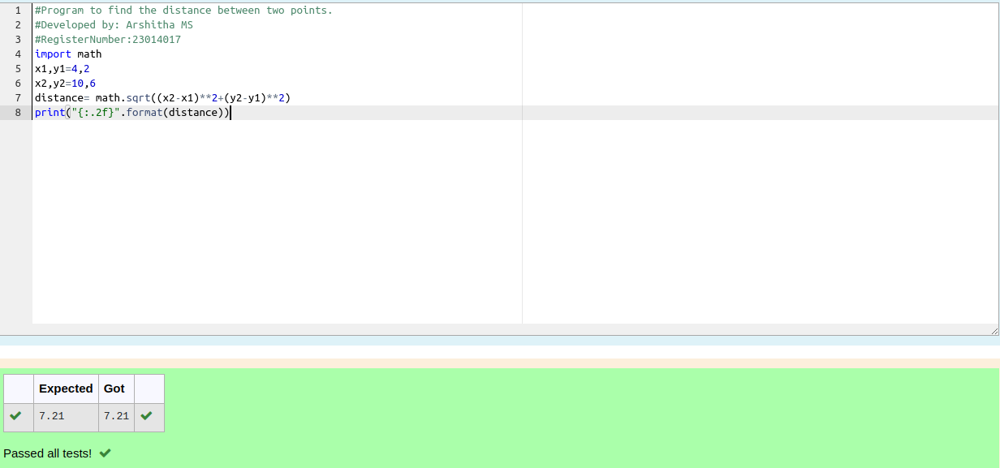

# DISTANCE-BETWEEN-TWO-POINTS

## AIM:
To write a python program to find the distance two 2 points
## ALGORITHM:
### Step 1: 
Start the program
### Step 2: 
Assign values for the variables x2,x1,y2,y1
### Step 3: 
Substitute the values in the distance formula  
### Step 4: 
Print the distance using format to display the answer with two decimal points.
### Step 5: 
End the program
### PROGRAM:
  ```
  #Program to find the distance between two points.
#Developed by: Arshitha MS
#RegisterNumber:23014017
import math
x1,y1=4,2
x2,y2=10,6
distance= math.sqrt((x2-x1)**2+(y2-y1)**2)
print("{:.2f}".format(distance))

```

### OUTPUT:


### RESULT:
